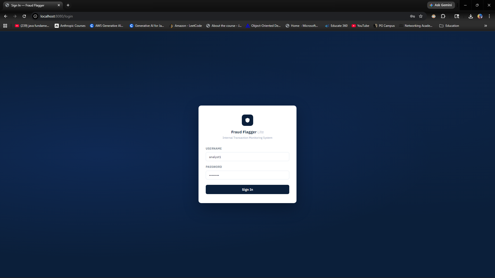
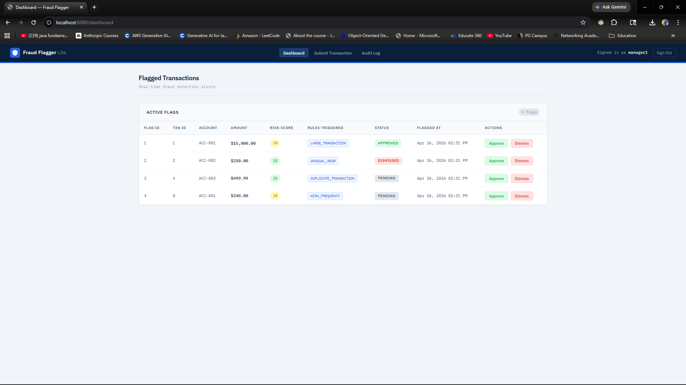
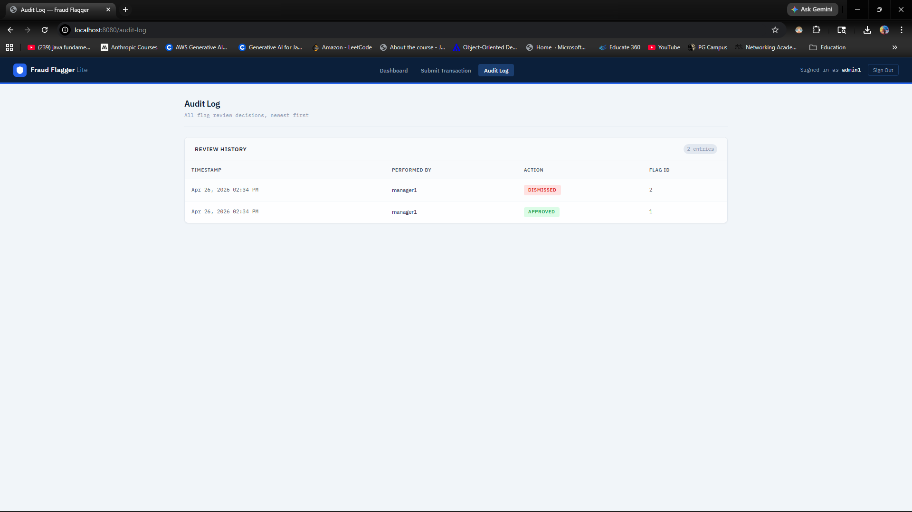

# Fraud Flagger Lite

A full-stack internal banking tool built with Java 21 and Spring Boot.  
Analysts submit transactions, a rules engine flags suspicious ones, and managers review and resolve each flag — with every decision written to an audit log.

---

## Why I Built This

I built this project to demonstrate enterprise-style Java development skills relevant to financial services engineering roles.  
It covers the full backend stack: data modeling, business logic, MVC controllers, authentication, authorization, and audit trails.

---

## Tech Stack

| Layer | Technology |
|---|---|
| Language | Java 21 (Temurin) |
| Framework | Spring Boot 3.5 |
| Security | Spring Security |
| Database | H2 (in-memory) |
| ORM | Spring Data JPA / Hibernate |
| UI | Thymeleaf |
| Build | Maven |

---

## Features

- **Transaction submission** — Analysts submit transactions tied to monitored bank accounts
- **Fraud rules engine** — Each transaction is automatically evaluated against 4 rules:
    - Large transaction (amount > $10,000) → +30 risk points
    - High frequency (4+ transactions from same account within 10 minutes) → +30 risk points
    - Duplicate transaction (same amount + merchant within 5 minutes) → +25 risk points
    - Unusual hour (midnight to 5am) → +15 risk points
    - Risk score capped at 100
- **Dashboard** — Displays all flagged transactions with risk score, rules triggered, and status
- **Manager review** — Managers can approve or dismiss each flag via POST endpoints (role-enforced)
- **Audit log** — Every approve/dismiss action is recorded with the reviewer's username and timestamp
- **Role-based access control** — Three roles (ANALYST, MANAGER, ADMIN) with server-side route protection and UI that adapts per role
- **BCrypt password hashing** — Passwords are never stored in plaintext

---

## How to Run

**Requirements:** Java 21, Maven (included via `mvnw.cmd`)

```bash
git clone https://github.com/TehAutumnCore/fraud-flagger.git
cd fraud-flagger
./mvnw spring-boot:run
```

Then open: http://localhost:8080

**Test accounts (seeded automatically):**

| Username | Password | Role |
|---|---|---|
| analyst1 | password | ANALYST |
| manager1 | password | MANAGER |
| admin1 | password | ADMIN |

---

## Screenshots

### Login Page


### Dashboard (Manager view — flags with Approve/Dismiss)


### Audit Log


---

## Project Structure

```
src/main/java/com/gary/fraudflagger/
├── config/       # Security configuration, seed data
├── controller/   # MVC controllers (Dashboard, Transactions, Flags)
├── model/        # JPA entities (Account, Transaction, FraudFlag, AuditLog, User)
├── repository/   # Spring Data JPA repositories
└── service/      # Business logic (fraud rules engine, audit logging)
```
---

## What I'd Add With More Time

- Persistent database (PostgreSQL)
- Pagination on the dashboard
- Email alerts when a high-risk flag is created
- Unit tests for the fraud rules engine
- Docker support for easy deployment